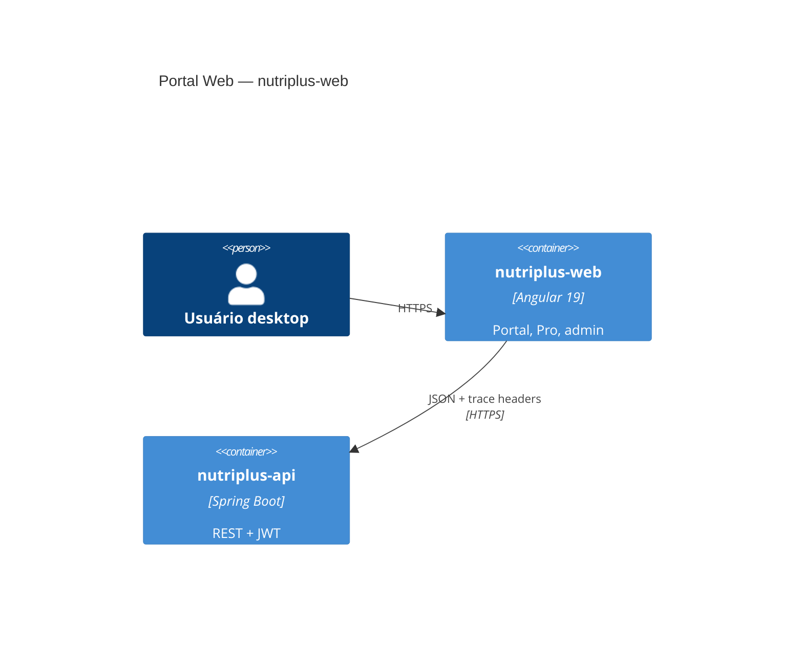

# Nutri+ Web — Arquitetura

Portal **Angular 19** (marketing, paciente `/app/*`, Nutri+ Pro, admin).

> **C4 canônico:** [`nutriplus-api/docs/C4.md`](../../nutriplus-api/docs/C4.md)  
> **Regras:** [`nutriplus-api/docs/RULES_MAP.md`](../../nutriplus-api/docs/RULES_MAP.md)  
> **Guardrails:** [`nutriplus-api/docs/LATENCY_GUARDRAILS.md`](../../nutriplus-api/docs/LATENCY_GUARDRAILS.md)

---

## Visão C4 (nível 2 — slice web)



O portal **não** fala com `nutriplus-agentes` diretamente.

---

## Camadas (Clean Architecture + DDD)

```
src/
  domain/           # entities, repository ports (interfaces)
  infrastructure/   # HTTP adapters, auth facade, tracing
  presentation/     # components por área (marketing, portal, pro, admin)
  design-system/    # tokens alinhados ao Flutter
  app/              # routes, guards, config
```

| Camada | Responsabilidade |
|--------|------------------|
| **presentation** | UI, rotas, guards desktop-only |
| **infrastructure** | `ApiClient`, interceptors trace, session storage |
| **domain** | Contratos de repositório; sem HTTP |

---

## Fluxos críticos

### Login → dashboard (Tier S)

Preferir **`GET /app/bootstrap`** ou `Promise.all` de calls independentes — meta ≤ 3 requests no first paint.

Ver [LATENCY_GUARDRAILS.md](../../nutriplus-api/docs/LATENCY_GUARDRAILS.md) (RULE-UX-002, RULE-UX-004).

### Geração de plano (Tier C)

`MealPlanGenerationFacade` — polling de status; paridade com Flutter `PlanGenerationController`.

### Zerar plano

`PlanResetEntryComponent` (`presentation/portal/plan-reset/`) — confirmação destrutiva + `PLAN_RESET`.

Doc: [PLAN_REGENERATION.md](../../nutriplus-api/docs/PLAN_REGENERATION.md)

### Ciclo de vida da conta

Congelar / excluir conta: **somente portal web** (`WebPortalClientVerifier` na API).

Doc: [ACCOUNT_LIFECYCLE.md](../../nutriplus-api/docs/ACCOUNT_LIFECYCLE.md)

---

## Trace

Mesmos headers que Flutter: `X-Correlation-Id`, `X-Trace-Id`, `X-Flow-Id`, `X-Session-Id`.

Implementação: `infrastructure/tracing/` (ver [`OBSERVABILITY.md`](../../nutriplus-api/docs/OBSERVABILITY.md)).

---

## Componentes C4 (nível 3 — Web)

| Componente | Caminho |
|------------|---------|
| `MealPlanGenerationFacade` | `application/portal/meal-plan/` |
| `PlanResetEntryComponent` | `presentation/portal/plan-reset/` |
| `AuthFacade` | `application/auth/` |
| Bootstrap consumer | dashboard / shell portal |

---

## Documentos relacionados

| Doc | Conteúdo |
|-----|----------|
| [docs/README.md](./README.md) | Rotas completas |
| [nutriplus-api/docs/FEATURES.md](../../nutriplus-api/docs/FEATURES.md) | Paridade Flutter/Web/API |
| [nutriplus-api/docs/CLIENT_LOADING_UX.md](../../nutriplus-api/docs/CLIENT_LOADING_UX.md) | Busy states, bootstrap |
